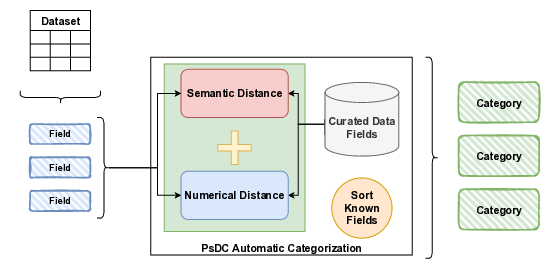

# PsDC Modeling

We previously published a novel Privacy-sensitive Data Categorization model named Privacy-sensitive Data Categorization (PsDC). This categorization model was developed as an initial step towards building a privacy quantification framework. While data categorization is crucial, the lack of an automated method makes it difficult to implement the aforementioned framework. In this work, we propose a method to automatically classify data using the PsDC categorization. Our method explores semantic and numerical features to identify similar data streams and propagate previously known categories. To evaluate our idea, five experts manually categorized 11 datasets, resulting in 127 data fields. Our proposed method achieved approximately 70% accuracy with this limited dataset, showcasing the potential of the approach.

## Run the evaluation

All necessary dependencies are listed in [requirements](requirements.txt).

To run the code, simply create a Python environment, install the required packages, and execute the notebook.

There are two scritps, `categories.py` and `main.py`.
The first (`categories.py`) processes the experts manucal categorization and generates `metadata.json`.
The second (`main.py`) uses the `metadata.json` to train and evaluate the model.

## Acknowledgment

The authors would like to express their thanks to the five volunteer experts that manually categorized the 11 datasets used in this study: Tiago Almeida, Tiago Costa, Guilherme Matos, Gabriel Boia, and Rafael Dias.

## Author

* [**Catarina Silva**](https://github.com/catarinaacsilva)

## License

This project is licensed under the MIT License - see the [LICENSE](LICENSE) file for details.